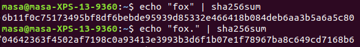

\pagenumbering{roman}

\pagebreak

# ABSTRACT
Blockchain is a versatile and scalable technology that most people associate exclusivly with Bitcoin. Blockchain has many more uses than just Bitcoin and is will become necessary in the near future. Current technology can't leverage all of the processing and resources that we have available. Blockchain allows us to leverage most or all of the processing power and storage on a network securely in a very scalable way. Current implementations are not perfect and there are a lot of social and environmental issues. However with a little more research and adoption Blockchain will make as big of a difference as the Internet did when it was first introduced. 

\pagebreak

\renewcommand*\contentsname{TABLE OF CONTENTS}

\tableofcontents

\pagebreak

\pagenumbering{arabic}

# INTRODUCTION
Whenever people hear the word Blockchain genereally the first thing people thing about is Bitcoin or other crytocurrencies.
There is however so much more to Blockchain technology than cryptocurrencies.
In a world of increased demand for data processing and security, we need systems with increased reliability and scalability. 
The current model for the internet does not scale that well and is quickly approaching a point at which we will not be able to keep up with the ever increasing demands of the public. 
Enter Blockchain, a new technology will allow us to leverage more of the resources that we have at our disposal that are wasted by the current model of the internet. 

I'll start this paper by discussing what Blockchain is, who created it, and a breif summary of how it works.
I'll folow this with a simple explaination of how Blockchain works. 
I’ll then talk about the creator of the first Blockchain: The mysterious Satoshi Nakamoto.

Then we get to the fun stuff. 
If there were no concrete implementations of this technology this wouldn't be an interesting topic. 
There are three main Blockchain implementations that I want to talk about. 
First, everyone's favorite form of legal gambling: Bitcoin. 
Second, as we start producing exponentially increasing amount of data we need a better way of storing and transmitting data. 
The InterPlanetary File System (IPFS) is the solution to the oversaturated and transient nature of the internet.

But nothing is entirely good, all advancements have drawbacks. Blockchain is no exception. The "Bitcoin goldrush" has had negative effects on the economics of computer parts.
Computers have, especially graphics processors have skyrocketed in price due to the demand as blockchains require a significant amount of processing to function. The significant amount of processing power also has another drawback in the form of power usage. 
Without further ado lets get into it!

# BLOCKCHAIN

## What is Blockchain?
So you likely have heard of Blockchain before, but more than likely you only associate it with Bitcoin. 
So what exactly is Blockchain?
One definition is:

> A continuously growing list of records, called *blocks*, which are linked and secured using cryptography. Each block generally contains a cryptogrphic hash of the previous block [@BlockchainIntroduction].

Another definition is: 

> "An open, distributed ledger that can record transactions between two parties efficiently and in a verifiable and permanent way".

Lets unpack these definitions. 
`A Blockchain is a continuously growing list of records`, this means that a Blockchain never removes any records it only adds records.

`Which are linked`, this signifies that there is a difinite order and connection between records.

`And secured using cyptography`, I'll go over this more later, but a major requirement for a Blockchain is that it needs to be secure and definite order needs to be preserved. 
If blocks were not cryptographically secured, a whole host of issues can pop up. 
For one it there is the double-spending problem.
If there wasn't a definite order to the blocks it would be possible to effectively spend your money twice and there would be no way of determining which of the transactions were correct. 
Another issue that may come up if blocks are not cryptographically secured is faked transactions.
If blocks aren't cryptographically secured it would be pretty easy to broadcast unauthorized transactions because there is no safeguard against doing so.

The last important part of the definition, and the reason the second definition was included, is that a Blockchain is `An open, distributed ledger`. 
A Blockchain must be publically visible, otherwise it may be secretly edited decreasing confidence in the implementation. 
Finally a Blockchain must be distributed, a big reason Blockchain is as capable as it is. 
Blockchain networks are peer to peer, meaning that rather than connecting to a central server all transactions happen from computer to computer on the network.
Every computer on this network is called a node.
There is a safety in numbers that comes with being distributed.
There is no single point of failure in such a system.
In fact you would need to control over 50% of the computing power of a network to falsify a transaction.

## Operation

Blockchains use public-key encryption to verify user to user transactions and crytographic hashes to verify block to block transactions.
Public-key encryption works by giving a user a private key, which is kept secret and a public key, which is given freely to anyone who the user wants to do business with. 
Public-key encryption is bi-directional meaning that if data is encrypted by the public key it can only be decrypted by the corresponding private key, and vice-versa [@Cryptography].
This system can be leveraged to encrypt data to be visible by only one person if the data is encrypted by that persons public key. 
However what we are more interested in in the context of Blockchain is the opposite operation. 
If you encrypt a piece of data with your private key, anyone who receives that data can be sure that it was sent by you, as it can only be decrypted by your public key.
The most popular version of public-key encryption is RSA encryption and consecuently it is what is used in most Blockchain implementations.

A cryptographic hash is a unique identifier for a piece of data that is almost impossible to counterfeit.
It basically takes the data and does a bunch of math to it and creates a unique number that has nothing to do with the input. 

As a demonstration I've created hashes of "fox" and "fox.", as you can see they are entirely unique.

Blocks are verified through a process called mining. 
We call nodes that are trying to verify blocks miners. 
This process is generally pretty complicated and specific to each implementation of Blockchain. 
I will not be going over any of the mining proceedures in this discussion. 
But as a general overview whenever a node is notified of a new block it starts trying to verify it. 
The process is generally complicated enough that only one node will verify each block even though all the blocks on the network are trying to. 
The miner generally gets a reward based on the amount of work they put in.  

## History

Blockchain technology was originally created for use with the Bitcoin network. 
It was designed by "Japanese" cryptographer Satoshi Nakamoto. 

Satoshi released the first paper on cryptocurrency in November of 2008. 
Bitcoin was released in it's entirety in January of 2009 as open source software.
The was initialized when Satoshi mined the first ever block on the chain, known as the genesis block. 

Little is known about Satoshi, other than the fact that he is estimated to have 1 million bitcoins.
That translates to around $10 billion USD at the time of writing this paper. 
Satoshi being a cryptographer was incredibly meticulous when hiding his identity.
To this day no one really knows who he is. 
The CIA claims to know who he is but that information is not disclosed publicly so we have no idea if that is true or not.  

Satoshi handed off development of Bitcoin in 2010, not much has been heard from him since.
His legacy, however, is far reaching and 

# BLOCKCHAIN IMPLEMENTATIONS

## Bitcoin
## InterPlanetary File System
## Etherium
[//]: # (Talk about bitnation.)
[//]: # (Land registration.)

# ADVANTAGES

# DISADVANTAGES

## Use of private keys
## Reliance on RSA

# ETHICAL CONCERNS

## Economical Concerns

## Environmental Concerns

# CONCLUSION

\pagebreak

# Bibliography
