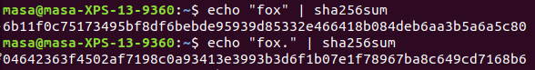
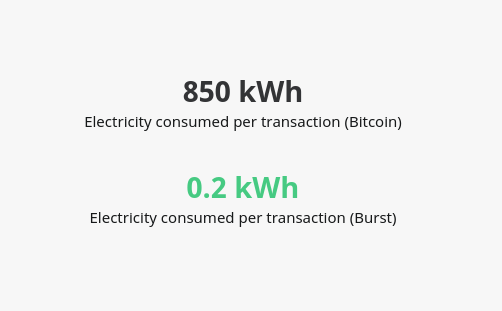

\pagenumbering{roman}

\pagebreak

# ABSTRACT
Blockchain is a versatile and scalable technology that most people associate exclusivly with Bitcoin. Blockchain has many more uses than just Bitcoin and is will become necessary in the near future. Current technology can't leverage all of the processing and resources that we have available. Blockchain allows us to leverage most or all of the processing power and storage on a network securely in a very scalable way. Current implementations are not perfect and there are a lot of social and environmental issues. However with a little more research and adoption Blockchain will make as big of a difference as the Internet did when it was first introduced. 

\pagebreak

\renewcommand*\contentsname{TABLE OF CONTENTS}

\tableofcontents

\pagebreak

\pagenumbering{arabic}

# INTRODUCTION
Whenever people hear the word Blockchain genereally the first thing people thing about is Bitcoin or other crytocurrencies.
There is however so much more to Blockchain technology than cryptocurrencies.
In a world of increased demand for data processing and security, we need systems with increased reliability and scalability. 
The current model for the internet does not scale that well and is quickly approaching a point at which we will not be able to keep up with the ever increasing demands of the public. 
Enter Blockchain, a new technology will allow us to leverage more of the resources that we have at our disposal that are wasted by the current model of the internet. 

I'll start this paper by discussing what Blockchain is, who created it, and a breif summary of how it works.
I'll folow this with a simple explaination of how Blockchain works. 
I’ll then talk about the creator of the first Blockchain: The mysterious Satoshi Nakamoto.

Then we get to the fun stuff. 
If there were no concrete implementations of this technology this wouldn't be an interesting topic. 
There are three main Blockchain implementations that I want to talk about. 
First, everyone's favorite form of legal gambling: Bitcoin. 
Second, as we start producing exponentially increasing amount of data we need a better way of storing and transmitting data. 
The InterPlanetary File System (IPFS) is the solution to the oversaturated and transient nature of the internet.

But nothing is entirely good, all advancements have drawbacks. Blockchain is no exception. The "Bitcoin goldrush" has had negative effects on the economics of computer parts.
Computers have, especially graphics processors have skyrocketed in price due to the demand as blockchains require a significant amount of processing to function. The significant amount of processing power also has another drawback in the form of power usage. 
Without further ado lets get into it!

# BLOCKCHAIN

## What is Blockchain?
So you likely have heard of Blockchain before, but more than likely you only associate it with Bitcoin. 
So what exactly is Blockchain?
One definition is:

> A continuously growing list of records, called *blocks*, which are linked and secured using cryptography. Each block generally contains a cryptogrphic hash of the previous block [@BlockchainIntroduction].

Another definition is: 

> "An open, distributed ledger that can record transactions between two parties efficiently and in a verifiable and permanent way".

Lets unpack these definitions. 
`A Blockchain is a continuously growing list of records`, this means that a Blockchain never removes any records it only adds records.

`Which are linked`, this signifies that there is a difinite order and connection between records.

`And secured using cyptography`, I'll go over this more later, but a major requirement for a Blockchain is that it needs to be secure and definite order needs to be preserved. 
If blocks were not cryptographically secured, a whole host of issues can pop up. 
For one it there is the double-spending problem.
If there wasn't a definite order to the blocks it would be possible to effectively spend your money twice and there would be no way of determining which of the transactions were correct. 
Another issue that may come up if blocks are not cryptographically secured is faked transactions.
If blocks aren't cryptographically secured it would be pretty easy to broadcast unauthorized transactions because there is no safeguard against doing so.

The last important part of the definition, and the reason the second definition was included, is that a Blockchain is `An open, distributed ledger`. 
A Blockchain must be publically visible, otherwise it may be secretly edited decreasing confidence in the implementation. 
Finally a Blockchain must be distributed, a big reason Blockchain is as capable as it is. 
Blockchain networks are peer to peer, meaning that rather than connecting to a central server all transactions happen from computer to computer on the network.
Every computer on this network is called a node.
There is a safety in numbers that comes with being distributed.
There is no single point of failure in such a system.
In fact you would need to control over 50% of the computing power of a network to falsify a transaction.

## Operation

Blockchains use public-key encryption to verify user to user transactions and crytographic hashes to verify block to block transactions.
Public-key encryption works by giving a user a private key, which is kept secret and a public key, which is given freely to anyone who the user wants to do business with. 
Public-key encryption is bi-directional meaning that if data is encrypted by the public key it can only be decrypted by the corresponding private key, and vice-versa [@Cryptography].
This system can be leveraged to encrypt data to be visible by only one person if the data is encrypted by that persons public key. 
However what we are more interested in in the context of Blockchain is the opposite operation. 
If you encrypt a piece of data with your private key, anyone who receives that data can be sure that it was sent by you, as it can only be decrypted by your public key.
The most popular version of public-key encryption is RSA encryption and consecuently it is what is used in most Blockchain implementations.

A cryptographic hash is a unique identifier for a piece of data that is almost impossible to counterfeit.
It basically takes the data and does a bunch of math to it and creates a unique number that has nothing to do with the input. 

As a demonstration I've created hashes of "fox" and "fox.", as you can see they are entirely unique.

Blocks are verified through a process called mining. 
We call nodes that are trying to verify blocks miners. 
This process is generally pretty complicated and specific to each implementation of Blockchain. 
I will not be going over any of the mining proceedures in this discussion. 
But as a general overview whenever a node is notified of a new block it starts trying to verify it. 
The process is generally complicated enough that only one node will verify each block even though all the blocks on the network are trying to. 
The miner generally gets a reward based on the amount of work they put in.  

## History

Blockchain technology was originally created for use with the Bitcoin network. 
It was designed by "Japanese" cryptographer Satoshi Nakamoto. 

Satoshi released the first paper on cryptocurrency in November of 2008. 
Bitcoin was released in it's entirety in January of 2009 as open source software.
The was initialized when Satoshi mined the first ever block on the chain, known as the genesis block. 

Little is known about Satoshi, other than the fact that he is estimated to have 1 million bitcoins.
That translates to around $10 billion USD at the time of writing this paper. 
Satoshi being a cryptographer was incredibly meticulous when hiding his identity.
To this day no one really knows who he is. 
The CIA claims to know who he is but that information is not disclosed publicly so we have no idea if that is true or not.  

Satoshi handed off development of Bitcoin in 2010, not much has been heard from him since.
His legacy, however, is far reaching and strong. 
Many others have built upon his ideas to make useful projects, where his original project was really more of a proof of concept. 

# BLOCKCHAIN IMPLEMENTATIONS

## Bitcoin

When people think of Blockchain the first thing that comes to mind is generally Bitcoin.
Unlike most other Blockchain technologies it's only purpose is to hold value.
Bitcoin uses a system where new coins are added to the syste as a reward to miners who verify blocks. 
Over time less and less new coins enter the system and the miners then get paid in transaction fees from the senders of transactions.
The supply limit of Bitcoin is 21,000,000 there are currently 16,858,782 Bitcoin circulating.
Bitcoin will reach the supply limit in 2140 assuming it is still active till then.

Bitcoin was the original Blockchain implementation, it was really rough around the edges and did not have a lot of real world experience to draw from when it was designed.
At low loads Bitcoin is estimated to have a maximum of around 3.3 to 7 transactions a second.
There is a minimum wait time of 10 minutes between transaction blocks as well. 

In real life condiitons this is even worse.
There is currently an average wait time of around 78 minutes per transaction and as high as 1188 minutes. 
Transaction fees are around $25 on average. 
Bitcoin was created to replace other forms of currency but that just isn't realistic with Bitcoin's implementation.
Bitcoin is far too low volume and inefficient to replace our current currencies.
Bitcoin is really just glorified gambling.

## InterPlanetary File System

IPFS is interesting because it is more of a hybrid service. 
IPFS is a file storage and distribution platform. 
What makes it really different from other platforms is that it distributes files peer to peer, but it is cryptogaphically secure.
IPFS allows users to address content based on the content itself (remember the cryptographic hashes we talked about earlier) rather than where the content is stored.
This is really significant because this prevents links from ever going dead.
As long as someone somewhere has accessed that link the data exists on their computer and can be passed on to the next person.

It would not exist without the Blockchain, but it also borrows elements from many other technologies.
It borrows the block exchange technology from BitTorrent, and versioning from Git [@IPFS]. 
Another thing IPFS borrows from BitTorrent is their contribution strategy. 
BitTorrent initially had an issue where people would only download data without contributing back.
They solved this by limiting the data that nodes that didn't contribute back to the system could access.

In a world where steaming content is becoming more and more a part of our lives we need better ways to distribute content.
Due to the nature of IPFS, it eliminated a lot of the waste associated with many people streaming the same content.
Let's say in some fantastical situation there are thirty people in the same room watching the same TV show on different devices. 
Now remember that IPFS is content addressed rather than location addressed. 
Therefore, IPFS would recognize this and tell each device to download a different part of the episode.
Each device would then send the data that it downloaded to each other device.
This would decrease the server load thirty fold and the network load significantly as well. 
Over large scale networks and watching a large variety of content researchers have shown that a Peer-to-Peer system such as this ca reduce network load by up to 60% over traditional delivery systems [@P2P-VDN].

## Etherium

Etherium is to processing as IPFS is to storage.
It allows us to leverage all the wasted processing power that we have available to us, in a safe way. 
Etherium is a 256-bit virtual machine that has potentially limitless processing power. 
It allows us to do transactions that have conditions, which we will call smart contracts. 
One thing that is really interesting about Etherium is that it is not only users that are addressed, but the contracts have addresses as well.
This allows transactions to chain into eachother.

Transactions work as follows [@EtheriumAndSolidarity]:

1. The Etherium Virtual Machine verifies the transactions code, and makes sure that it is valid and contains no errors.
1. The Etherium Virtual Machine calculates the transaction fees based on how much work the code has to do.
1. User initializes the payment.
1. Transfer the value of the transaction. Or if the recieving account is a contrct run that transaction's code.
1. If the sending account does not have enough currency to complete the transaction. 
All changes are rolled back. The miner gets to keep all accrued transaction fees up to this point however.
1. If an error happens in the code, same as the previous set all changes are rolled back.

Using this protocol we can leverage the largest super computer that exists: all of our devices that we are currently not using.
There are many applications of this technology that are interesting.
There is a nation that was creating on top of Etherium called Bitnation. 
It currently has around 15,000 citizens.
Unlike traditional nations where the nation is based on a physical location, this nation is all online and automated.
Bitnation offers IDs, online voting, a digital public notary, land titles and birth certificate.
All with minimal human interaction. 

[//]: # (Land registration.)

# DISADVANTAGES

## Use of private keys
Due to the heavy reliance on private keys there are concerns that you could lose everything in a second.
If you misplace your private key you effectively cease to exist.
If your key is stolen the theif can pretend to be you.

There are many "wallet" services out there where your private key is stored on someone else's server. 
While this is convienient, it basically defeates the purpose of having a completely distributed service. 
This also opens you up to the possibility of being hacked, leading to even more potential problems.

## Reliance on RSA
There is evidence that with the advent of quantum computers RSA will become almost completely useless [@QuantumFactoring]. 
As a result we should be doing research into alternative forms of cryptography for use in Blockchain technology. 
If we don't, the day that RSA is cracked the entire Blockchain infrastructure will collapse.

# ETHICAL CONCERNS

Due to the massive computation necessary for many Blockchain technologies to work, especially Bitcoin. 
This causes certain computer parts to be exponentially more expensive.
Due to their usefulness in Bitcoin minng, graphics processers have become much more expensive.
This is a concern because Bitcoin doesn't actually provide much value to the world, it is artificially inflating the cost of consumer hardware just so some people can make a quick buck.

Bitcoin has also been a huge power sink. Bitcoin mining uses about 65 TWh of energy every year [@digiconomist].
That is about .29% of the global energy consumption. 
Every transaction on the bitcoin network can power around 29 homes in the US. 
It is especially becoming an issue in iceland.
Iceland has attracted many mining farms due to low energy costs and low temperatures, reducing the total costs significantly due to not having to worry about cooling the minng rigs.
Currently mining uses more energy than the total energy consumed by residents [@IcelandMining].

There is another technology that addresses all these points.
Burstcoin is a next generation cryptocurrency that does all the processing upfrount rather than having to process whenever a new block is created. 
Burstcoin stores all of it's work onto empty diskspace and just looks through it's disk whenever it needs to verify a transaction.
As a result it has near instant transaction times, with no transaction throughput limit [@BurstDymaxion].
Not to mention it uses considerably less power as shown in the figure below.

The only issue with Burstcoin right now is it is not as well known so it isn't worth that much [@coinmarketcap].
If we as a society transition to Burstcoin we can solve a lot of the issues with cryptocurrency as a concept and maybe it will replace the dollar one day.
Bitcoin should be retired as at this point it is an archaic and primitive technology.

# CONCLUSION
In the past few pages we have discusssed what Blockchain is and how much more it is than just Bitcoin. 
We talked about many of the applications of the technology, and some of the disadvantages.
There is a lot of work that needs to be done before Blockchain as widespread as the internet, but we are getting there.
There are a lot of issues with the current implementaitions but we are always looking for new ways to innovate on previous iterations of the Blockchain.
After those issues are all ironed out Blockchain will become as prevalent as the internet, and I for one am looking forward to that!

\pagebreak

# Bibliography
